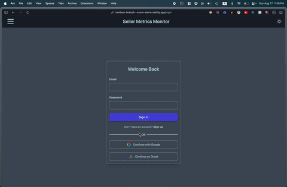
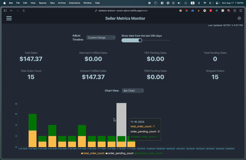
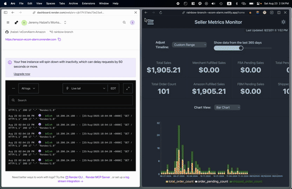
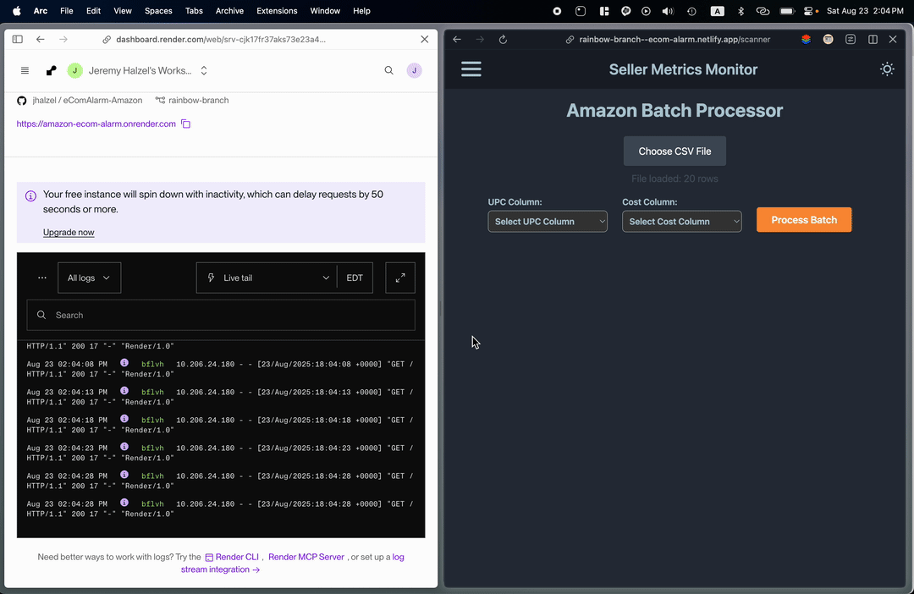
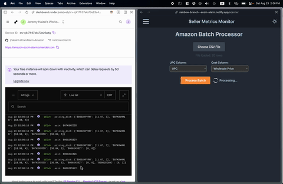
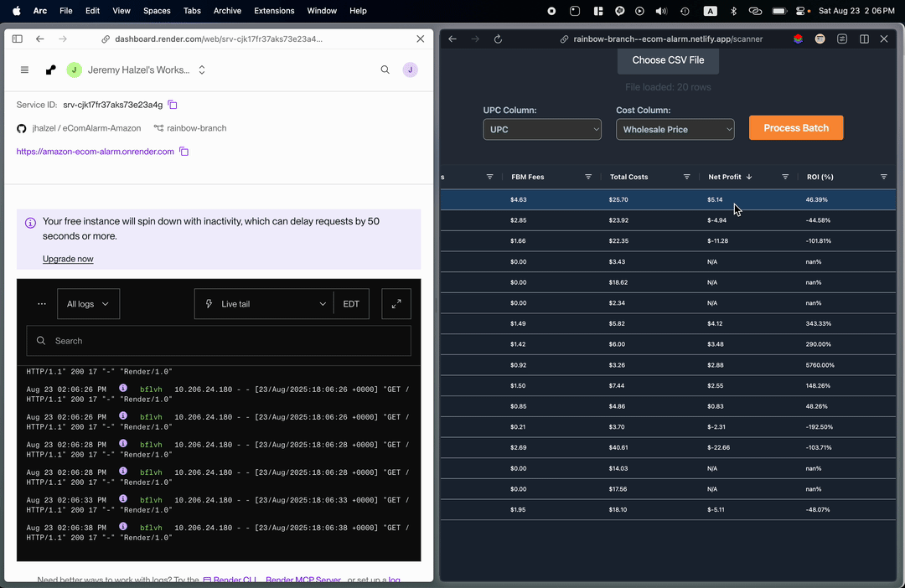
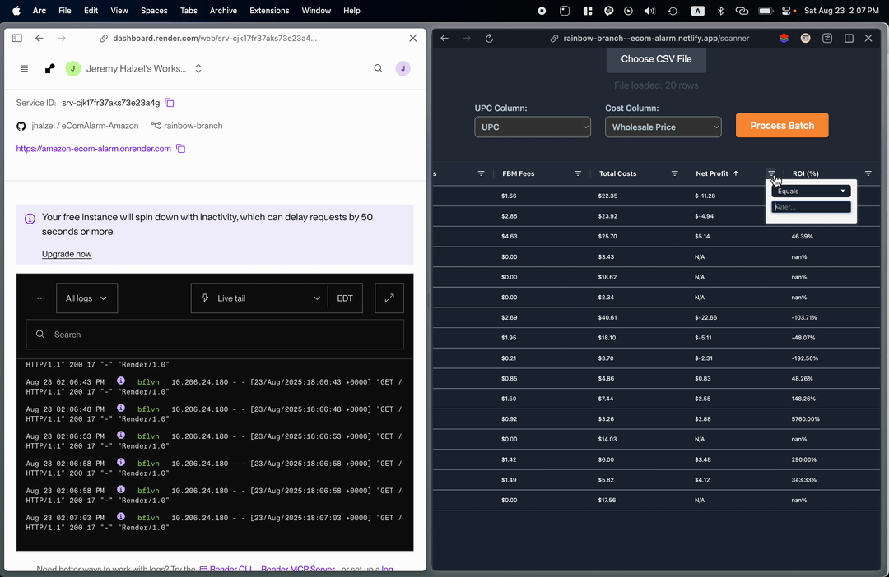

# AMZ Wholesale Analytics

## Overview
AMZ Wholesale Analytics is a proof-of-concept full-stack tool for Amazon sellers that provides:

- A **historical sales dashboard** with adjustable time filters.
- A **wholesale profit margin scanner** for uploaded CSVs.
- **Automated backend updates** via GitHub Actions (every 15 minutes).

> **Note:** This project requires an active Amazon SP-API subscription. Since the owner is no longer selling on Amazon, SP-API access may stop, so functionality could be affected after a month.

---

## Technical Stack

**Backend:**
- Flask (`/src/server/trial.py`, `/src/server/script.py`)
- Flask-CORS
- Firebase Admin SDK (`firebase_admin`)
- Amazon SP-API integration
- Python 3.9
- dotenv for environment variables

**Frontend:**
- React (`/src/client/src/pages/Scanner.jsx`, `/src/client/src/pages/Home.jsx`)
- ag-grid-react for data tables
- PapaParse for CSV parsing
- Tailwind CSS + DaisyUI for styling
- Theme switching (`/src/client/src/components/ThemeController.jsx`, `/src/client/src/context/themeContext/index.jsx`)

**Automation/CI:**
- GitHub Actions (`.github/workflows/actions.yaml`) runs `script.py` every 15 minutes

---

## How It Works

- **Amazon Seller Data Integration:** Fetches and processes sales/order data using SP-API credentials.
- **Historical Sales Dashboard:** Visualizes sales trends with interactive charts and tables.
- **Profit Margin Scanner:** Upload a CSV, parse UPC/costs, calculate profit margins minus fees, and display results in ag-grid tables.
- **Theme Switching:** Supports light/dark mode across the dashboard.
- **Firebase Integration:** Reads/writes data to Firebase Realtime Database.
- **Automated Data Updates:** GitHub Actions triggers backend scripts every 15 minutes to update data.

---

## Demo Videos
### Dashboard – Historical Sales
  
*Showcases the adjustable time filter and sales chart visualization (Part 1).*

  
*Additional sales chart interactions (Part 2).*

---

### Scanner – Profit Margin Analysis
  
*CSV upload and initial processing (Part 1).*

  
*Profit margin calculation in progress (Part 2).*

  
*Batch process visualization (Part 3).*

  
*Quick insights generation (Part 4).*

  
*Final results and summary (Part 5).*


### GitHub Actions Automation
  
*Shows the automated 15-minute backend data update workflow.*

> **Note:** Add your `.mp4` files to the repo and update these links.

---

## Quick Start

1. **Clone the repo**
```bash
git clone https://github.com/jhalzel/amz-wholesale-analytics.git
cd amz-wholesale-analytics
